# 📚 Documentación Técnica - Sistema P2P Arbitrage

## 🏛️ Arquitectura de Base de Datos

### **Modelo Entidad-Relación**
```
users (Usuarios)
  ├─ vault (Bóveda Personal)
  │    └─ vault_movements (Movimientos)
  │
  └─ general_cycles (Ciclos Generales)
       └─ daily_cycles (Ciclos Diarios)
            ├─ orders (Órdenes)
            │    └─ transactions (Transacciones)
            ├─ market_prices (Precios)
            └─ alerts (Alertas)
```

### **Relaciones Clave**
- Un usuario tiene una bóveda única (relación 1:1)
- Un usuario puede tener múltiples ciclos generales (1:N)
- Un ciclo general contiene N ciclos diarios según duration_days (1:N)
- Un ciclo diario puede tener múltiples órdenes (1:N)
- Una orden puede tener múltiples transacciones - ejecuciones parciales (1:N)
- Vault tiene historial completo de movimientos (1:N)

---

## 🗄️ Especificación de Tablas

### **1. users - Usuarios del Sistema**
```sql
CREATE TABLE users (
  id SERIAL PRIMARY KEY,
  username VARCHAR(50) UNIQUE NOT NULL,
  email VARCHAR(100) UNIQUE NOT NULL,
  password_hash VARCHAR(255) NOT NULL,
  role VARCHAR(20) CHECK (role IN ('admin', 'operator', 'supervisor')),
  status VARCHAR(20) DEFAULT 'active',
  created_at TIMESTAMP DEFAULT CURRENT_TIMESTAMP,
  last_login TIMESTAMP
);
```

**Roles:**
- `admin`: Acceso total al sistema
- `operator`: Gestión de ciclos y operaciones propias
- `supervisor`: Solo lectura y reportes

---

### **2. vault - Bóveda de Capital**
```sql
CREATE TABLE vault (
  id SERIAL PRIMARY KEY,
  user_id INT UNIQUE NOT NULL REFERENCES users(id),
  balance_disponible DECIMAL(18,2) DEFAULT 0,    -- Capital listo para usar
  balance_invertido DECIMAL(18,2) DEFAULT 0,     -- Capital en ciclos activos
  ganancias_acumuladas DECIMAL(18,2) DEFAULT 0,  -- Histórico de ganancias
  total_depositos DECIMAL(18,2) DEFAULT 0,       -- Suma de depósitos
  total_retiros DECIMAL(18,2) DEFAULT 0,         -- Suma de retiros
  created_at TIMESTAMP DEFAULT CURRENT_TIMESTAMP,
  updated_at TIMESTAMP DEFAULT CURRENT_TIMESTAMP
);
```

**Regla de Balance:**
```
balance_total = balance_disponible + balance_invertido
```

---

### **3. vault_movements - Movimientos de Bóveda**
```sql
CREATE TABLE vault_movements (
  id SERIAL PRIMARY KEY,
  vault_id INT NOT NULL REFERENCES vault(id),
  type VARCHAR(50) CHECK (type IN (
    'deposit',                -- Depósito externo
    'withdrawal',             -- Retiro externo
    'transfer_to_cycle',      -- Transferir a ciclo
    'transfer_from_cycle',    -- Retornar desde ciclo
    'profit',                 -- Ganancia registrada
    'loss'                    -- Pérdida registrada
  )),
  amount DECIMAL(18,2) NOT NULL,
  balance_antes DECIMAL(18,2),
  balance_despues DECIMAL(18,2),
  general_cycle_id INT REFERENCES general_cycles(id),
  daily_cycle_id INT REFERENCES daily_cycles(id),
  description TEXT,
  created_at TIMESTAMP DEFAULT CURRENT_TIMESTAMP
);

-- Índices para búsquedas rápidas
CREATE INDEX idx_vault_movements_vault ON vault_movements(vault_id);
CREATE INDEX idx_vault_movements_type ON vault_movements(type);
CREATE INDEX idx_vault_movements_cycle ON vault_movements(general_cycle_id);
CREATE INDEX idx_vault_movements_created ON vault_movements(created_at);
```

---

### **4. general_cycles - Ciclos Generales**
```sql
CREATE TABLE general_cycles (
  id SERIAL PRIMARY KEY,
  user_id INT NOT NULL REFERENCES users(id),
  name VARCHAR(100) NOT NULL,
  
  -- Configuración
  capital_inicial_general DECIMAL(18,2) NOT NULL,
  duration_days INT CHECK (duration_days IN (7, 15, 30, 60, 90)),
  platform_id INT REFERENCES platforms(id),
  currency_id INT REFERENCES currencies(id),
  
  -- Parámetros operativos
  target_profit_percent DECIMAL(5,4) NOT NULL,  -- Ej: 0.0257 = 2.57%
  commission_percent DECIMAL(5,4) NOT NULL,     -- Ej: 0.0035 = 0.35%
  
  -- Fechas
  start_date DATE NOT NULL,
  end_date DATE NOT NULL,
  
  -- Resultados
  capital_final_general DECIMAL(18,2),
  ganancia_total DECIMAL(18,2),
  rentabilidad_porcentaje DECIMAL(8,4),
  
  -- Estado
  status VARCHAR(20) DEFAULT 'active' 
    CHECK (status IN ('active', 'completed', 'cancelled', 'paused')),
  
  config_params JSONB,
  created_at TIMESTAMP DEFAULT CURRENT_TIMESTAMP,
  completed_at TIMESTAMP
);
```

---

### **5. daily_cycles - Ciclos Diarios**
```sql
CREATE TABLE daily_cycles (
  id SERIAL PRIMARY KEY,
  general_cycle_id INT NOT NULL REFERENCES general_cycles(id) ON DELETE CASCADE,
  day_number INT NOT NULL,
  date DATE NOT NULL,
  
  -- Capital al inicio del día
  usdt_boveda_inicio DECIMAL(18,8) DEFAULT 0,
  fiat_disponible_inicio DECIMAL(18,2) DEFAULT 0,
  capital_inicial_dia DECIMAL(18,2) NOT NULL,
  
  -- Capital al cierre del día
  usdt_boveda_cierre DECIMAL(18,8) DEFAULT 0,
  fiat_disponible_cierre DECIMAL(18,2) DEFAULT 0,
  capital_final_dia DECIMAL(18,2),
  
  -- Operaciones del día
  total_usdt_comprados DECIMAL(18,8) DEFAULT 0,
  total_usdt_vendidos DECIMAL(18,8) DEFAULT 0,
  total_fiat_gastado DECIMAL(18,2) DEFAULT 0,
  total_fiat_recibido DECIMAL(18,2) DEFAULT 0,
  comisiones_pagadas DECIMAL(18,2) DEFAULT 0,
  
  -- Resultados
  ganancia_neta_dia DECIMAL(18,2) DEFAULT 0,
  rentabilidad_dia DECIMAL(8,4),
  
  -- Estadísticas
  num_compras INT DEFAULT 0,
  num_ventas INT DEFAULT 0,
  ordenes_activas BOOLEAN DEFAULT false,
  
  -- Precios de referencia
  precio_usdt_apertura DECIMAL(18,8),
  precio_usdt_cierre DECIMAL(18,8),
  
  -- Estado
  status VARCHAR(20) DEFAULT 'pending' 
    CHECK (status IN ('pending', 'active', 'completed', 'skipped')),
  
  notes TEXT,
  created_at TIMESTAMP DEFAULT CURRENT_TIMESTAMP,
  started_at TIMESTAMP,
  completed_at TIMESTAMP,
  
  UNIQUE(general_cycle_id, day_number)
);

-- Índices
CREATE INDEX idx_daily_cycles_general_cycle ON daily_cycles(general_cycle_id);
CREATE INDEX idx_daily_cycles_date ON daily_cycles(date);
CREATE INDEX idx_daily_cycles_status ON daily_cycles(status);
```

---

### **6. orders - Órdenes Publicadas**
```sql
CREATE TABLE orders (
  id SERIAL PRIMARY KEY,
  daily_cycle_id INT NOT NULL REFERENCES daily_cycles(id) ON DELETE CASCADE,
  type VARCHAR(10) CHECK (type IN ('buy', 'sell')),
  
  -- Datos de publicación
  cantidad_publicada DECIMAL(18,8) NOT NULL,
  precio_publicado DECIMAL(18,8) NOT NULL,
  monto_total_publicado DECIMAL(18,2) NOT NULL,
  fecha_publicacion TIMESTAMP DEFAULT CURRENT_TIMESTAMP,
  
  -- Ejecución
  cantidad_ejecutada DECIMAL(18,8) DEFAULT 0,
  precio_promedio_ejecutado DECIMAL(18,8),
  monto_total_ejecutado DECIMAL(18,2) DEFAULT 0,
  porcentaje_ejecutado DECIMAL(5,2) DEFAULT 0,
  
  -- Fechas de ejecución
  fecha_primera_ejecucion TIMESTAMP,
  fecha_ultima_ejecucion TIMESTAMP,
  
  -- Costos
  comision DECIMAL(18,2) DEFAULT 0,
  
  -- Estado
  status VARCHAR(20) DEFAULT 'published' 
    CHECK (status IN ('published', 'partial', 'completed', 'cancelled', 'paused')),
  is_active BOOLEAN DEFAULT true,
  
  paused_at TIMESTAMP,
  cancelled_at TIMESTAMP,
  notes TEXT,
  
  created_at TIMESTAMP DEFAULT CURRENT_TIMESTAMP,
  updated_at TIMESTAMP DEFAULT CURRENT_TIMESTAMP
);

-- Índices
CREATE INDEX idx_orders_daily_cycle ON orders(daily_cycle_id);
CREATE INDEX idx_orders_type ON orders(type);
CREATE INDEX idx_orders_status ON orders(status);
CREATE INDEX idx_orders_is_active ON orders(is_active);

-- Trigger para updated_at
CREATE TRIGGER update_orders_updated_at 
  BEFORE UPDATE ON orders 
  FOR EACH ROW 
  EXECUTE FUNCTION update_updated_at_column();
```

---

### **7. transactions - Transacciones Ejecutadas**
```sql
CREATE TABLE transactions (
  id SERIAL PRIMARY KEY,
  order_id INT NOT NULL REFERENCES orders(id),
  daily_cycle_id INT NOT NULL REFERENCES daily_cycles(id),
  type VARCHAR(10) CHECK (type IN ('buy', 'sell')),
  
  -- Datos de la transacción
  cantidad_usdt DECIMAL(18,8) NOT NULL,
  precio_ejecutado DECIMAL(18,8) NOT NULL,
  monto_fiat DECIMAL(18,2) NOT NULL,
  comision DECIMAL(18,2) DEFAULT 0,
  
  -- Estado antes/después (para auditoría)
  usdt_boveda_antes DECIMAL(18,8),
  usdt_boveda_despues DECIMAL(18,8),
  fiat_antes DECIMAL(18,2),
  fiat_despues DECIMAL(18,2),
  
  timestamp_ejecucion TIMESTAMP DEFAULT CURRENT_TIMESTAMP,
  notes TEXT,
  created_at TIMESTAMP DEFAULT CURRENT_TIMESTAMP
);

-- Índices
CREATE INDEX idx_transactions_order ON transactions(order_id);
CREATE INDEX idx_transactions_daily_cycle ON transactions(daily_cycle_id);
CREATE INDEX idx_transactions_timestamp ON transactions(timestamp_ejecucion);
```

---

## 🔄 Flujo de Capital (Crítico)

### **Regla de Oro: 100% del Capital Siempre Rastreable**
```
Estado del Capital en Sistema:
├─ Vault Balance Disponible (listo para usar)
├─ Vault Balance Invertido (en ciclos activos)
└─ En Daily Cycles (distribuido entre USDT y Fiat)

SIEMPRE: 
  vault.balance_disponible + vault.balance_invertido = Capital_Total_Usuario
```

### **Transición de Capital entre Días**
```sql
-- Al cerrar Día N:
UPDATE daily_cycles 
SET 
  capital_final_dia = (usdt_boveda_cierre × precio_usdt_cierre) + fiat_disponible_cierre,
  ganancia_neta_dia = capital_final_dia - capital_inicial_dia,
  rentabilidad_dia = (ganancia_neta_dia / capital_inicial_dia) × 100
WHERE id = N;

-- Al iniciar Día N+1 (reinversión compuesta):
UPDATE daily_cycles 
SET 
  capital_inicial_dia = (SELECT capital_final_dia FROM daily_cycles WHERE id = N),
  usdt_boveda_inicio = (SELECT usdt_boveda_cierre FROM daily_cycles WHERE id = N),
  fiat_disponible_inicio = (SELECT fiat_disponible_cierre FROM daily_cycles WHERE id = N)
WHERE id = N+1;
```

---

## 🧮 Sistema de Cálculos Detallado

### **1. Precio de Compra (P_C)**
```javascript
/**
 * Calcular precio de compra competitivo
 * Objetivo: Ser el comprador más atractivo
 */
function calcularPrecioCompra(precioCompetenciaVenta) {
  const P_C = precioCompetenciaVenta - 0.001;
  
  return {
    precio_compra: P_C,
    razon: "Precio 0.001 menor que competencia para atraer vendedores"
  };
}

// Ejemplo:
// Competencia vende a: $1.025
// Nosotros compramos a: $1.024
// → Vendedores nos preferirán
```

### **2. Precio de Venta (P_V) con Validaciones**
```javascript
/**
 * Calcular precio de venta con ganancia objetivo
 */
function calcularPrecioVenta(precioCompra, gananciaNetaObjetivo, comisionPlataforma) {
  // Fórmula completa
  const P_V = (precioCompra * (1 + gananciaNetaObjetivo)) / (1 - comisionPlataforma);
  
  // Calcular punto de equilibrio
  const puntoEquilibrio = precioCompra / (1 - comisionPlataforma);
  
  // VALIDACIÓN CRÍTICA
  if (P_V <= puntoEquilibrio) {
    throw new Error({
      tipo: 'BLOQUEADO',
      mensaje: '⚠️ Precio causaría pérdida',
      datos: {
        precio_venta_calculado: P_V,
        punto_equilibrio: puntoEquilibrio,
        deficit: puntoEquilibrio - P_V,
        solucion: 'Aumentar precio de venta o reducir ganancia objetivo'
      }
    });
  }
  
  return {
    precio_venta: P_V,
    punto_equilibrio: puntoEquilibrio,
    margen_seguridad: P_V - puntoEquilibrio,
    ganancia_neta_esperada: precioCompra * gananciaNetaObjetivo
  };
}

// Ejemplo:
// P_C = $1.024
// Ganancia objetivo = 2.57% (0.0257)
// Comisión = 0.35% (0.0035)
// 
// P_V = ($1.024 × 1.0257) / 0.9965
// P_V = $1.051008 / 0.9965
// P_V = $1.0547
//
// Punto Equilibrio = $1.024 / 0.9965 = $1.0276
// Margen de seguridad = $1.0547 - $1.0276 = $0.0271 ✅
```

### **3. Cálculo de Comisión en Ventas**
```javascript
/**
 * Solo en VENTAS se cobra comisión
 */
function calcularComisionVenta(cantidadUSDT, precioEjecutado, porcentajeComision) {
  const montoBruto = cantidadUSDT * precioEjecutado;
  const comision = montoBruto * porcentajeComision;
  const montoNeto = montoBruto - comision;
  
  return {
    monto_bruto: montoBruto,
    comision: comision,
    monto_neto: montoNeto,
    porcentaje_comision: porcentajeComision × 100
  };
}

// Ejemplo:
// Vendemos: 976.5625 USDT a $1.053
// Bruto: 976.5625 × 1.053 = $1,028.32
// Comisión (0.35%): $1,028.32 × 0.0035 = $3.60
// Neto: $1,028.32 - $3.60 = $1,024.72 ✅
```

---

## 🛡️ Validaciones Críticas del Sistema

### **1. Validación de Capital Disponible**
```javascript
// ANTES de publicar COMPRA
async function validarCapitalParaCompra(dailyCycleId, montoFiat) {
  const cycle = await getDailyCycle(dailyCycleId);
  
  if (cycle.fiat_disponible_inicio < montoFiat) {
    throw new ValidationError({
      tipo: 'CAPITAL_INSUFICIENTE',
      mensaje: 'Fiat insuficiente para esta compra',
      disponible: cycle.fiat_disponible_inicio,
      requerido: montoFiat,
      deficit: montoFiat - cycle.fiat_disponible_inicio
    });
  }
}

// ANTES de publicar VENTA
async function validarCapitalParaVenta(dailyCycleId, cantidadUSDT) {
  const cycle = await getDailyCycle(dailyCycleId);
  
  if (cycle.usdt_boveda_inicio < cantidadUSDT) {
    throw new ValidationError({
      tipo: 'USDT_INSUFICIENTE',
      mensaje: 'USDT insuficiente en bóveda',
      disponible: cycle.usdt_boveda_inicio,
      requerido: cantidadUSDT,
      deficit: cantidadUSDT - cycle.usdt_boveda_inicio
    });
  }
}
```

### **2. Validación de Órdenes Activas**
```javascript
// ANTES de cerrar día
async function validarCierreDia(dailyCycleId) {
  const ordenesActivas = await pool.query(
    'SELECT COUNT(*) FROM orders WHERE daily_cycle_id = $1 AND is_active = true',
    [dailyCycleId]
  );
  
  if (ordenesActivas.rows[0].count > 0) {
    throw new ValidationError({
      tipo: 'ORDENES_PENDIENTES',
      mensaje: `Tienes ${ordenesActivas.rows[0].count} órdenes sin completar`,
      accion_sugerida: 'Cancela las órdenes o espera a que se completen'
    });
  }
}
```

### **3. Validación de Transferencias Vault ↔ Cycle**
```javascript
// TRANSFERIR DE VAULT A CICLO
async function validarTransferenciaACiclo(vaultId, generalCycleId, amount) {
  const vault = await getVault(vaultId);
  
  // Verificar balance disponible
  if (vault.balance_disponible < amount) {
    throw new Error('Balance insuficiente en bóveda');
  }
  
  // Verificar que el ciclo esté activo
  const cycle = await getGeneralCycle(generalCycleId);
  if (cycle.status !== 'active') {
    throw new Error('El ciclo no está activo');
  }
  
  // Verificar ownership
  if (vault.user_id !== cycle.user_id) {
    throw new Error('El ciclo no pertenece al usuario');
  }
}

// TRANSFERIR DE CICLO A VAULT
async function validarTransferenciaDesde Ciclo(generalCycleId, amount) {
  const dailyCycle = await getCurrentDailyCycle(generalCycleId);
  
  // Calcular fiat disponible en el ciclo
  const fiatDisponible = dailyCycle.fiat_disponible_inicio;
  
  if (fiatDisponible < amount) {
    throw new Error('Fiat insuficiente en el ciclo');
  }
  
  // No permitir si hay órdenes activas
  const hasActiveOrders = await checkActiveOrders(dailyCycle.id);
  if (hasActiveOrders) {
    throw new Error('No se puede transferir con órdenes activas');
  }
}
```

---

## 📊 Estados de Entidades

### **Estados de General Cycle**
```
active      → Ciclo en operación normal
completed   → Ciclo finalizado exitosamente
cancelled   → Ciclo cancelado por usuario
paused      → Ciclo pausado temporalmente
```

### **Estados de Daily Cycle**
```
pending     → Día aún no iniciado
active      → Día en curso, puede operar
completed   → Día cerrado, pasó a día siguiente
skipped     → Día omitido (ej: mercado cerrado)
```

### **Estados de Order**
```
published   → Orden publicada, esperando
partial     → Parcialmente ejecutada (1%-99%)
completed   → 100% ejecutada
cancelled   → Cancelada por operador
paused      → Pausada temporalmente
```

### **Transiciones de Estados**

```mermaid
stateDiagram-v2
    [*] --> published: Publicar
    published --> partial: Primera ejecución
    published --> completed: Ejecución completa
    published --> cancelled: Cancelar
    partial --> completed: Completar
    partial --> cancelled: Cancelar resto
    completed --> [*]
    cancelled --> [*]
```


---

## 🔄 Transacciones de Base de Datos

### **Principio ACID en Operaciones Críticas**
```javascript
/**
 * Todas las operaciones que modifican múltiples tablas
 * DEBEN usar transacciones con ROLLBACK automático
 */
async function registrarCompraNEW(orderData) {
  const client = await pool.connect();
  
  try {
    // Iniciar transacción
    await client.query('BEGIN');
    
    // 1. Actualizar orden
    await client.query(`
      UPDATE orders 
      SET cantidad_ejecutada = cantidad_ejecutada + $1,
          monto_total_ejecutado = monto_total_ejecutado + $2,
          porcentaje_ejecutado = (cantidad_ejecutada / cantidad_publicada) * 100
      WHERE id = $3
    `, [orderData.cantidad, orderData.monto, orderData.orderId]);
    
    // 2. Actualizar daily_cycle
    await client.query(`
      UPDATE daily_cycles 
      SET usdt_boveda_cierre = usdt_boveda_cierre + $1,
          fiat_disponible_cierre = fiat_disponible_cierre - $2,
          total_usdt_comprados = total_usdt_comprados + $1,
          total_fiat_gastado = total_fiat_gastado + $2
      WHERE id = $3
    `, [orderData.cantidad_usdt, orderData.monto_fiat, orderData.dailyCycleId]);
    
    // 3. Registrar transacción
    await client.query(`
      INSERT INTO transactions 
        (order_id, daily_cycle_id, type, cantidad_usdt, precio_ejecutado, monto_fiat)
      VALUES ($1, $2, 'buy', $3, $4, $5)
    `, [orderData.orderId, orderData.dailyCycleId, 
        orderData.cantidad_usdt, orderData.precio, orderData.monto_fiat]);
    
    // Si todo OK → COMMIT
    await client.query('COMMIT');
    
    return { success: true };
    
  } catch (error) {
    // Si hay error → ROLLBACK automático
    await client.query('ROLLBACK');
    console.error('Error en transacción:', error);
    throw error;
    
  } finally {
    // Siempre liberar conexión
    client.release();
  }
}
```

---

## 🚨 Sistema de Alertas

### **Tipos de Alertas**
```sql
CREATE TABLE alerts (
  id SERIAL PRIMARY KEY,
  user_id INT REFERENCES users(id),
  daily_cycle_id INT REFERENCES daily_cycles(id),
  type VARCHAR(20) CHECK (type IN ('critical', 'warning', 'info', 'success')),
  title VARCHAR(200),
  message TEXT,
  data JSONB,
  is_read BOOLEAN DEFAULT false,
  created_at TIMESTAMP DEFAULT CURRENT_TIMESTAMP
);
```

### **Ejemplos de Alertas**
```javascript
// CRÍTICA - Bloquea operación
{
  type: 'critical',
  title: '⚠️ OPERACIÓN BLOQUEADA',
  message: 'Precio de venta causaría pérdida',
  data: {
    precio_venta: 1.025,
    punto_equilibrio: 1.0276,
    deficit: 0.0026
  }
}

// ADVERTENCIA - Permite continuar
{
  type: 'warning',
  title: '⚠️ Ganancia Menor',
  message: 'Ganancia menor a objetivo',
  data: {
    ganancia_real: 0.005,  // 0.5%
    ganancia_objetivo: 0.0257  // 2.57%
  }
}

// INFO - Información general
{
  type: 'info',
  title: '✓ Día Completado',
  message: 'Día 1 cerrado exitosamente',
  data: {
    ganancia: 24.72,
    rentabilidad: 2.47,
    capital_siguiente: 1024.72
  }
}
```

---

## 📈 Optimizaciones de Base de Datos

### **Índices Estratégicos**
```sql
-- Para consultas frecuentes del dashboard
CREATE INDEX idx_daily_cycles_active 
  ON daily_cycles(general_cycle_id, status) 
  WHERE status = 'active';

-- Para búsqueda de órdenes activas
CREATE INDEX idx_orders_active 
  ON orders(daily_cycle_id, is_active) 
  WHERE is_active = true;

-- Para historial de transacciones
CREATE INDEX idx_transactions_date 
  ON transactions(daily_cycle_id, timestamp_ejecucion DESC);

-- Para movimientos de vault recientes
CREATE INDEX idx_vault_movements_recent 
  ON vault_movements(vault_id, created_at DESC);
```

### **Query Optimizada para Dashboard**
```sql
-- Obtener estado completo del usuario en una consulta
WITH user_vault AS (
  SELECT * FROM vault WHERE user_id = $1
),
active_cycles AS (
  SELECT 
    gc.*,
    COUNT(dc.id) as dias_completados,
    SUM(dc.ganancia_neta_dia) as ganancia_acumulada
  FROM general_cycles gc
  LEFT JOIN daily_cycles dc ON gc.id = dc.general_cycle_id 
    AND dc.status = 'completed'
  WHERE gc.user_id = $1 AND gc.status = 'active'
  GROUP BY gc.id
),
recent_movements AS (
  SELECT * FROM vault_movements 
  WHERE vault_id = (SELECT id FROM user_vault)
  ORDER BY created_at DESC
  LIMIT 10
)
SELECT 
  (SELECT row_to_json(user_vault.*) FROM user_vault) as vault,
  (SELECT json_agg(row_to_json(active_cycles.*)) FROM active_cycles) as cycles,
  (SELECT json_agg(row_to_json(recent_movements.*)) FROM recent_movements) as movements;
```

---

## 🔧 Variables de Entorno Completas

```bash
# ===============================
# DATABASE
# ===============================
DB_HOST=localhost
DB_PORT=5432
DB_NAME=p2p_arbitrage
DB_USER=postgres
DB_PASSWORD=tu_password_muy_segura

# ===============================
# SERVER
# ===============================
PORT=3000
NODE_ENV=production  # development | production | test
HOST=0.0.0.0

# ===============================
# JWT AUTHENTICATION
# ===============================
JWT_SECRET=clave_secreta_minimo_32_caracteres_cambiala_en_produccion
JWT_EXPIRE=24h

# ===============================
# BACKUP
# ===============================
BACKUP_PATH=/home/p2p-arbitrage/backups
BACKUP_TIME=00:00
BACKUP_RETENTION_DAYS=30

# ===============================
# PLATFORM DEFAULTS
# ===============================
DEFAULT_PLATFORM=binance
DEFAULT_CURRENCY=USD
DEFAULT_COMMISSION=0.0035  # 0.35%

# ===============================
# LOGGING
# ===============================
LOG_LEVEL=info  # error | warn | info | debug
LOG_FILE=/var/log/p2p-arbitrage/app.log

# ===============================
# CORS
# ===============================
CORS_ORIGIN=http://localhost:5173
```

---

## 🐛 Debugging y Troubleshooting

### **Ver Estado de Conexiones de BD**
```sql
-- Ver conexiones activas
SELECT 
  pid,
  usename,
  application_name,
  client_addr,
  state,
  query
FROM pg_stat_activity
WHERE datname = 'p2p_arbitrage';

-- Matar conexión específica
SELECT pg_terminate_backend(pid) 
FROM pg_stat_activity 
WHERE datname = 'p2p_arbitrage' 
  AND pid <> pg_backend_pid();
```

### **Queries de Debugging**
```sql
-- Verificar integridad de capital
SELECT 
  v.user_id,
  v.balance_disponible + v.balance_invertido as vault_total,
  COALESCE(SUM(dc.capital_inicial_dia), 0) as capital_en_ciclos,
  v.balance_disponible + v.balance_invertido - COALESCE(SUM(dc.capital_inicial_dia), 0) as diferencia
FROM vault v
LEFT JOIN general_cycles gc ON v.user_id = gc.user_id AND gc.status = 'active'
LEFT JOIN daily_cycles dc ON gc.id = dc.general_cycle_id AND dc.status = 'active'
GROUP BY v.id;

-- Ver última transacción de cada tipo
SELECT DISTINCT ON (type)
  type,
  cantidad_usdt,
  precio_ejecutado,
  monto_fiat,
  timestamp_ejecucion
FROM transactions
ORDER BY type, timestamp_ejecucion DESC;

-- Auditar movimientos de vault
SELECT 
  type,
  COUNT(*) as cantidad,
  SUM(amount) as monto_total,
  AVG(amount) as promedio
FROM vault_movements
WHERE vault_id = $1
GROUP BY type
ORDER BY monto_total DESC;
```

---

## 🚀 Performance Tips

### **1. Uso de Prepared Statements**
```javascript
// ✅ BUENO - Prepared statement
const result = await pool.query(
  'SELECT * FROM orders WHERE daily_cycle_id = $1',
  [dailyCycleId]
);

// ❌ MALO - Interpolación de strings
const result = await pool.query(
  `SELECT * FROM orders WHERE daily_cycle_id = ${dailyCycleId}`
);
```

### **2. Paginación en Listados**
```javascript
// Siempre usar LIMIT y OFFSET
async function getVaultMovements(vaultId, page = 1, perPage = 50) {
  const offset = (page - 1) * perPage;
  
  const result = await pool.query(`
    SELECT * FROM vault_movements 
    WHERE vault_id = $1 
    ORDER BY created_at DESC 
    LIMIT $2 OFFSET $3
  `, [vaultId, perPage, offset]);
  
  return result.rows;
}
```

### **3. Connection Pooling**
```javascript
// Configuración óptima del pool
const pool = new Pool({
  max: 20,                      // Máximo 20 conexiones
  idleTimeoutMillis: 30000,     // 30 segundos idle
  connectionTimeoutMillis: 2000, // 2 segundos timeout
});
```

---

**Última actualización: Noviembre 2025**
